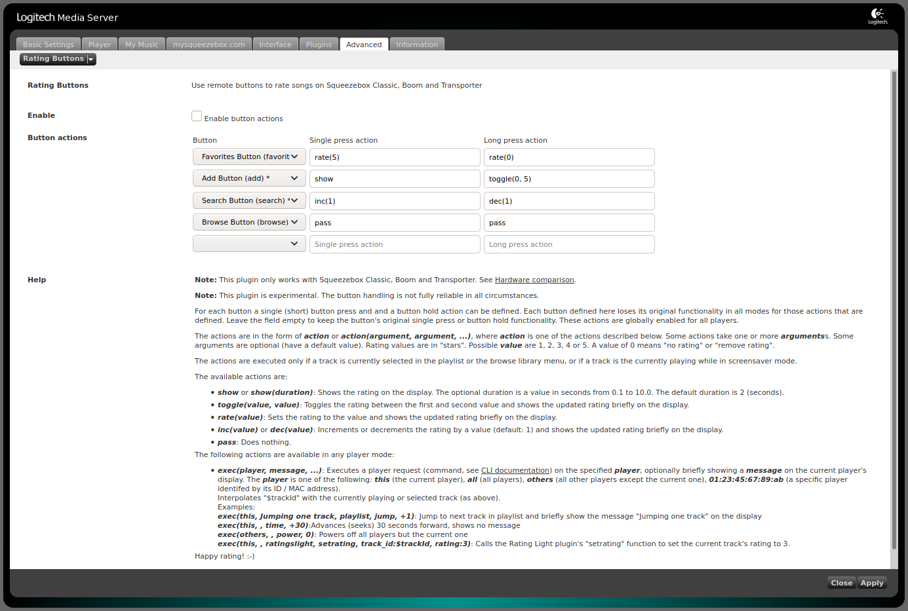
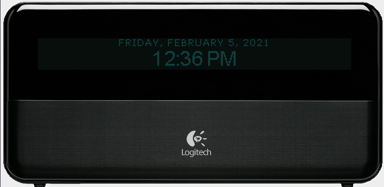

# flipflip's LMS plugins

For [Logitech Media Server](https://github.com/Logitech/slimserver)

Repo URL: <https://raw.githubusercontent.com/phkehl/lms-plugins/main/repo.xml>

## Rating Buttons

Use remote buttons to rate songs on Squeezebox Classic, Boom and Transporter.

Inspired by the [RatingsLight](https://github.com/AF-1/lms-ratingslight) and
[KidsPlay](https://tuxreborn.netlify.app/slim/kidsplay) plugins.

**Changelog:**

- v0.5 -- 2021-03-12
  - Fix title format rating
- v0.4 -- 2021-03-11
  - Add RATINGBUTTONS_RATING title format to display the rating (now playing screensaver, music information screen)
- v0.3 -- 2021-02-07
  - Add exec() action
  - Try to make butten press detection more reliable
  - Cleanup
- v0.2 -- 2021-02-06
  - Handle Boom hardware buttons (e.g. 'preset_1', 'add'). This is largely untested.
- v0.1 -- 2021-02-05
  - Initial version

