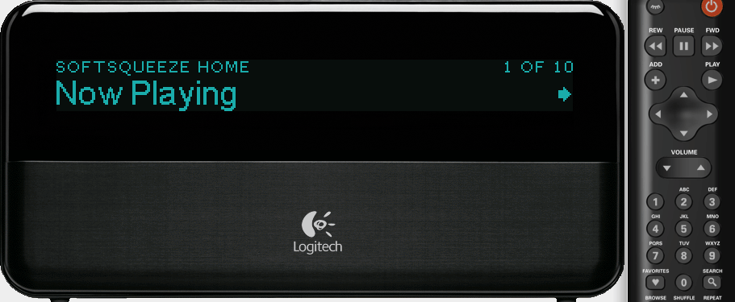
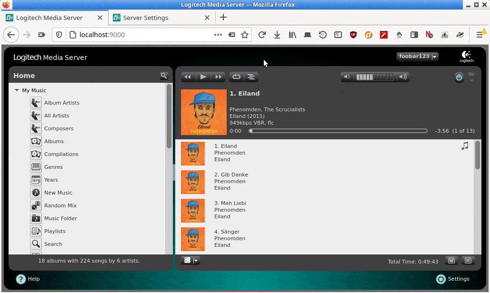

# flipflip's LMS plugins

For [Logitech Media Server](https://github.com/Logitech/slimserver)

Repo URL: <https://raw.githubusercontent.com/phkehl/lms-plugins/main/repo.xml>

## Rating Buttons

Use remote buttons and the default web interface to rate songs on Squeezebox Classic, Boom and Transporter.

Inspired by the [RatingsLight](https://github.com/AF-1/lms-ratingslight) and
[KidsPlay](https://tuxreborn.netlify.app/slim/kidsplay) plugins.

**Changelog:**
- v0.7 -- 2021-05-04
  - The RATINGBUTTONS_RATING title format is now called RATINGBUTTONS_RATING_NOTES.
  - Added RATINGBUTTONS_RATING_STARS title format.
  - Added RATINGBUTTONS_RATING_WEB title format for the web interface and some Javascript magic to make it look nice.
  - Allow changing rating through the web interface (in the playlist and on song info pages).
- v0.6 -- 2021-03-12
  - Add rating to track details view stars (and use stars instead of notesymbols in the web interface)
  - Add sub-menu to set rating of the track (on device, not (yet) in the web interface)
- v0.5 -- 2021-03-12
  - Fix title format rating
- v0.4 -- 2021-03-11
  - Add RATINGBUTTONS_RATING title format to display the rating (now playing screensaver, music information screen)
- v0.3 -- 2021-02-07
  - Add exec() action
  - Try to make butten press detection more reliable
  - Cleanup
- v0.2 -- 2021-02-06
  - Handle Boom hardware buttons (e.g. 'preset_1', 'add'). This is largely untested.
- v0.1 -- 2021-02-05
  - Initial version

**TODO:**

- Update GIF
- Show ratings in now playing list in the web interface
- Perhaps add function to change rating in web interface (though, Ratings Light can do that already..)
- Add to <https://github.com/LMS-Community/lms-plugin-repository>
